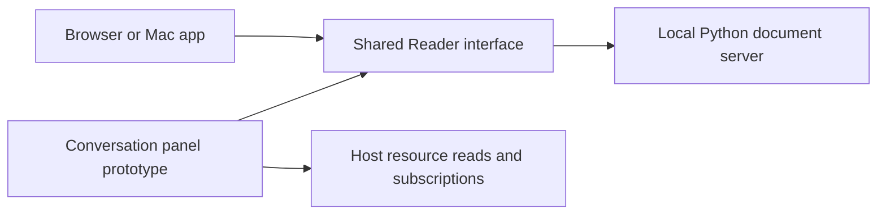

# Reader architecture

Reader displays documents through one web reading interface. A standard-library Python server owns local document I/O and preferences. The native Mac app wraps that interface in WKWebView and supplies operating-system actions. The read-only extension prototype serves the same interface to a desktop conversation host.

The local and embedded boot paths have different owners for document access. The local server enforces workspace grants and atomic saves. The embedded panel reads only the opaque resource supplied by the host. It cannot save. See [the document contract](../../context/document-integrity.md) before changing local I/O. See [the extension design](chatgpt-viewer.md) for the embedded boundary. Desktop routing is still unverified.
