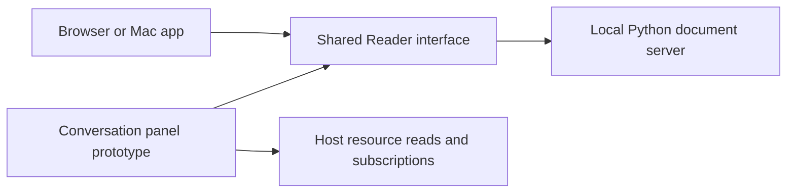

# Reader architecture

Reader displays documents through one web reading interface. A standard-library Python server owns local document I/O and preferences. The native Mac app wraps that interface in WKWebView and supplies operating-system actions. The read-only extension prototype serves the same interface to a desktop conversation host.

The local and embedded boot paths have different owners for document access. The local server enforces workspace grants and atomic saves. The embedded panel reads only the opaque resource supplied by the host. It cannot save. See [the document contract](../../context/document-integrity.md) before changing local I/O. See [the extension design](chatgpt-viewer.md) for the embedded boundary. Desktop routing is still unverified.

Local document navigation and save feedback stay in the shared interface. Each pane
owns its optional heading outline and document search. The native Edit menu calls the
page’s Find in Document command, which forwards to the active comparison pane. Find a
File belongs to the Files panel and uses Command-Shift-O. Command-P stays unclaimed.

The save label describes the current pane’s document and in-flight save. Dirty text
remains Unsaved until a save succeeds. A failed or conflicting save keeps the dirty
text and reports its outcome. Late saves cannot change another document’s label.
Live remains a separate disk-watch indicator. None of these controls adds write grants.
The embedded viewer retains its read-only status and its own toolbar controls.

The Mac wrapper owns installed-font enumeration through
`NSFontManager.shared.availableFontFamilies`. Its existing origin-checked,
main-frame-only bridge supplies names to the shared selectors. Comparison panes
ask their trusted parent. No font inventory is supplied by the Python server.
Lora is the sole bundled fallback; saved unavailable families are retained.
Browser and embedded modes use Lora and generic system defaults. They do not
request local-font permissions or probe a hardcoded list.
