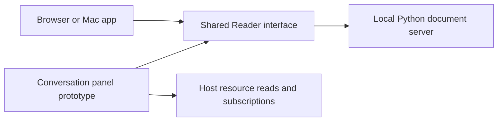

# Reader architecture

Reader displays documents through one web reading interface. A standard-library Python server owns local document I/O and preferences. The native Mac app wraps that interface in WKWebView and supplies operating-system actions. The read-only extension prototype serves the same interface to a desktop conversation host.

The local and embedded boot paths have different owners for document access. The local server enforces workspace grants and atomic saves. The embedded panel reads only the opaque resource supplied by the host. It cannot save. See [the document contract](../../context/document-integrity.md) before changing local I/O. See [the extension design](chatgpt-viewer.md) for the embedded boundary. Desktop routing is still unverified.

Local document navigation and save feedback stay in the shared interface. Each pane
owns its optional heading outline and document search. The native Edit menu calls the
page’s Find in Document command, which forwards to the active comparison pane. Find a
File belongs to the Files panel and uses Command-Shift-O. Command-P stays unclaimed.

The save label describes the current pane’s document and in-flight save. Dirty text
remains Unsaved until a save succeeds. A failed or conflicting save keeps the dirty
text and reports its outcome. Late saves cannot change another document’s label.
Live remains a separate disk-watch indicator. None of these controls adds write grants.
The embedded viewer retains its read-only status and its own toolbar controls.

The backend owns installed-font enumeration in `src/reader/fonts.py`
(`font_catalog`). Its OS-independent version-1 contract identifies the catalog as
`backend-machine`, includes platform and availability, and requires separate
viewer verification. Only the macOS adapter is implemented today: it asks
AppKit's `NSFontManager.availableFontFamilies` in a Python process's main thread.
Threaded HTTP requests invoke the same module as a bounded helper. Other OSes
return unavailable until their discovery adapter is added.

The authenticated Python `/api/fonts` route and the app-only MCP
`reader_font_catalog` tool call that same implementation. The MCP build copies
that exact Python module beside its Node bundle; Python 3 must be available on
the backend PATH (the Mac app already requires it). No additional listener,
font files, font bytes, hostname, or font paths are exposed. A remote MCP server
reports its own machine's families, never the viewer machine's inventory.

Both viewers use the shared selectors and saved-choice fallbacks in
`src/reader/web/app.js` (`refreshFontFamilies`). The Mac wrapper no longer
supplies font names through its WebKit bridge. Native comparison panes ask their
parent for the backend catalog. Browser and embedded views compare rendered
canvas text widths with two fallback stacks before offering a backend family;
this conservative heuristic may omit faces it cannot distinguish. It requests
no browser enumeration permission and sends no rendering results to the server.
Lora is the sole bundled fallback. Discovery failure or unavailable rendering
keeps clear defaults; saved unavailable choices remain saved.

Verification record, 2026-10-03, Reader 2.7.0 font change `326b30a`: macOS
backend discovery, authenticated HTTP, real stdio MCP, and simulated-host iframe
rendering have focused checks in `tests/server/test_fonts.py`,
`tests/chatgpt/server.integration.test.mjs`, and
`tests/chatgpt/browser/embedded.spec.mjs`. The user confirmed the local Mac app
works, then confirmed the extension works. This is user-reported acceptance of
the actual host; automated rendering evidence remains the simulated iframe, and
Codex UI access was not used. Windows/Linux font discovery is future work.

Validation for this change: all 35 shared UI cases, nine MCP/session cases,
four focused service/HTTP cases, and the embedded cases passed (18 in the
aggregate run, then its corrected legacy tool-call assertion and final font/
privacy cases in focused runs). Changed-file ESLint, Ruff 0.16.10 and SwiftLint
0.65.1 pass. The Mac build, signature, exact resource copies, and plugin package
check pass. Python aggregate has 125 passes and one baseline layout failure:
`SourceLayoutTests.test_root_has_no_legacy_source_or_generated_app_outputs`
expects `legacy == []`, but old untracked `macos/` and `test-results/` directories
exist with ignored metadata only. The same assertion fails using its unchanged
source from baseline `35e4c57`; those directories were not removed.

The local Reader Dev bundle was rebuilt from `326b30a`; the supported CLI reports
`reader-markdown-dev@reader-dev` installed and enabled from that generated path.
The rebuilt stdio tool returns 179 macOS families. The production plugin was not
updated as part of local verification. Future installations need Python 3 on the
MCP backend PATH and should repeat the checks in `docs/embedded-acceptance.md`.
Verify installed bytes rather than trusting the unchanged 2.7.0 version. Use
`install/Reader.command` for authorized Mac updates and the documented host
lifecycle for plugins; never launch the generated Mac bundle directly.

See [source ownership](source-layout.md) for the layout, its history, compatibility
entrypoints, and the test areas. Unobserved host checks live in
[embedded acceptance](../embedded-acceptance.md), rather than completed plans.
Installed choices are saved as `font:` followed by the exact family name; legacy
keys resolve when installed. Missing choices remain saved and show their fallback.
The family list refreshes at boot and when Settings opens. A failed refresh keeps
the previous list. CSS names are quoted and selector labels are text.
