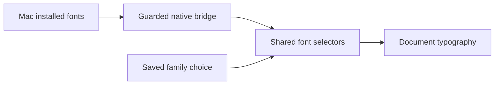

# Proposed font ownership

The native wrapper supplies names; the shared interface chooses a family and
stores that choice in existing preferences. Lora provides an offline fallback.
Missing installed families do not erase a saved choice. Browser and conversation
hosts use generic system faces because they do not supply a permitted font list.
